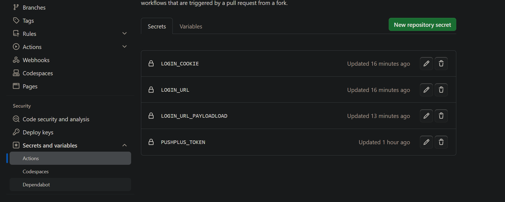
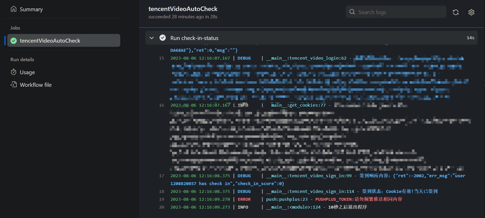

  <h2 align="center"><storng>自动签到</storng></h2>
  

    autoCheck-in
    Github Action版
     
     
     
  

## 🎈今日签到状态

---

## **⚡ 支持**   

* [x] 腾讯视频每日凌晨自动签到
* [x] 腾讯视频每日凌晨自动领取一小时V力值任务【前提已完成，否则为0】
* [x] 腾讯视频自动推送每日完成任务情况
* [x] 爱奇艺自动领取并完成日常任务
* [x] 爱奇艺自动推送每日完成任务情况
* [x] 贴吧自动签到

---

## 🍝使用说明

#### 🙍🏻‍♀️腾讯视频配置流程

1. Fork 本仓库，然后点击你的仓库右上角的 Settings，找到 Secrets 这一项actions，添加 `LOGIN_COOKIE` 、`LOGIN_URL`、 `LOGIN_URL_PAYLOADLOAD`、`PUSHPLUS_TOKEN`、`GET_VIP_INFO_URL_PAYLOAD`五个Secrets。

   

2. 设置好环境变量后点击你的仓库上方的 `Actions` 选项，第一次打开需要点击 `I understand...` 按钮，确认在 Fork 的仓库上启用 GitHub Actions 。

3. 任意发起一次commit，可以参考下图流程修改readme文件。(可以不用操作，可以手动启动workflows)

   - 打开`README.md`，点击修改按钮

   - 修改任意内容，这里在末尾插入了空格。移动到最下面，点击提交。

4. 至此自动签到就搭建完毕了。

### 

|       Secrets名称        |             介绍             | 启用是否必须 |                            说明                             |
| :----------------------: | :--------------------------: | :----------: | :---------------------------------------------------------: |
|          BDUSS           |       贴吧login_cookie       |      是      |           不写，不启用贴吧任务，失败之后重新获取            |
|        LOG_LEVEL         |      日志级别默认为INFO      |      否      | 修改为DEBUG可看到更多内容，方便查错，同时部分用户信息会暴露 |
|       LOGIN_COOKIE       |     腾讯视频login_cookie     |      是      |         不写，不启用腾讯视频任务，失败之后重新获取          |
|        LOGIN_URL         |      腾讯视频login_url       |      是      |                      失败之后重新获取                       |
|  LOGIN_URL_PAYLOADLOAD   |  腾讯视频login_url的请求体   |      否      |                        失败建议加上                         |
| GET_VIP_INFO_URL_PAYLOAD | 腾讯视频获取会员信息的请求体 |      否      |                        失败建议加上                         |
|      PUSHPLUS_TOKEN      |        推送加的token         |      否      |               建议加上，能够推送任务完成情况                |
|        IQY_COOKIE        |      爱奇艺login_cookie      |      是      |          不写，不启用爱奇艺任务，失败之后重新获取           |

---

#### 🙍🏻‍♂️login_cookie等参数的获取

1. 网页登录 [腾讯视频](v.qq.com)
2. 进入该网页：https://vip.video.qq.com/fcgi-bin/comm_cgi?name=hierarchical_task_system&cmd=2
3. F12 输入在控制台输入document.cookie然后回车，得到的全部信息就是login_cookie；
5. 获取配置信息的效果图如下：

5. 或者登录成功之后F12，F5依次输入，然后搜索NewRefresh，这个url就是`LOGIN_URL`， `LOGIN_URL_PAYLOADLOAD`就是这个url的请求体。
6. `PUSHPLUS_TOKEN`公众号pushplus获取

> - 注意：
>   - 如果报错没有通过图像验证，需要在cookie中加入vdevice_qimei36='...'[使用常用手机打开获取](https://m.v.qq.com/schemeurl)。
>   - 加上使用一段时间之后，又出现图形验证，需要手动签到一次。

7. `GET_VIP_INFO_URL_PAYLOAD`[同样方法获取该链接的请求体](https://vip.video.qq.com/rpc/trpc.query_vipinfo.vipinfo.QueryVipInfo/GetVipUserInfoH5)
7. 爱奇艺的`IQY_COOKIE`同理，扫码登录[爱奇艺](https://iqyi.com)官网之后，点击[链接](http://serv.vip.iqiyi.com/vipgrowth/query.action)进入控制台查看cookie
7. 网址扫码登录贴吧官网之后，然后按下`F12`打开调试模式，在`cookie`中找到`BDUSS`，并复制其`Value`值。

---

#### 🙎🏻‍♀️配置workflow执行信息写入到run.log

1. 仓库左上方settings

2. 如图

3. 如图，保存

---

## 🚗查看运行状态

进入jobs查看check-in-status步骤即可查看输出日志

---

## 📞注意事项

- 推送代码只写了PUSHPLUS的，可以自己拓展其他的推送
- 已经测试COOKIE有效时间超过三个月 目前还没过期
- 腾讯视频
  - 不是所有帐号都能签到成功因为有的帐号会触发滑块认证或者短信验证
  - 使用常用手机打开后面的连接，注意是https，成功进入之后点击查看设备信息，QIMEI36字段就是vdevice_qimei36='...'，按照cookie格式加在LOGIN_COOKIE末尾即可。
  - 注意：如果你平时签到之类的都需要验证码和滑块验证，加上这个字段之后并不能解决问题。目前部分账号会出现安全验证。

---

## ✨相似项目

- [bigoceans/TencentVideoAutoCheck](https://github.com/bigoceans/TencentVideoAutoCheck)
- [bigoceans/TencentVideoAutoCheck2.0](https://github.com/bigoceans/TencentVideoAutoCheck2.0)
- [tjsky/TieBaSign](https://github.com/tjsky/TieBaSign)
- [raindrop-hb/tencent-video](https://github.com/raindrop-hb/tencent-video)
- [arlettebrook/tencentVideoSign-in](https://github.com/arlettebrook/tencentVideoSign-in)

本项目基于以上项目开发，感谢支持。

---

## 🚔声明

**本项目仅供学习研究，请勿滥用！下载后请于24小时内删除，多谢合作！**

